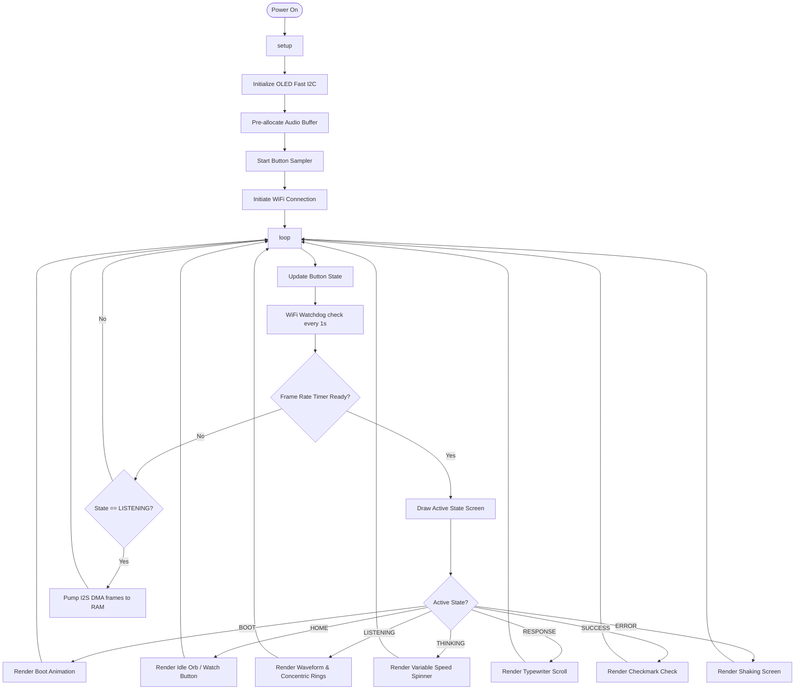

# Fayas_AI.ino

The central coordinator and application entry point for the Fayas AI Voice Assistant. It manages the global application state machine, reads physical button inputs, caps rendering framerates, and drives state transitions.

---

## 🗺️ Execution Flow

---

## 🏗️ State Machine Flow

This file coordinates the state machine (`AppState`) using a standard `switch-case` dispatch loop:

1. **`AppState::BOOT`**
   - Renders the boot animation showing the logo and diagnostic readouts (e.g. free heap size, chip reset code).
   - Once completed, transitions automatically to `AppState::HOME`.
2. **`AppState::HOME`**
   - Displays the resting idle animation (breathing orb with a particle field) and updates the WiFi status icon.
   - Listens for a physical button press. Transitions to `AppState::LISTENING` upon push.
3. **`AppState::LISTENING`**
   - Powers up the I2S clocks, stabilizes the INMP441 modulator, and streams audio data into a heap buffer in real-time.
   - Shows concentric pulsing rings and a voice peak waveform.
   - Transitions to `AppState::THINKING` once the button is released or the recording buffer is filled.
4. **`AppState::THINKING`**
   - Plays the orbiting spinner animation.
   - Sequentially calls the Whisper STT and Llama LLM APIs over HTTPS.
   - If successful, transitions to `AppState::RESPONSE`. On timeout/failure, transitions to `AppState::ERROR_STATE`.
5. **`AppState::RESPONSE`**
   - Typewrites the AI text response to the OLED screen.
   - Waits for a button click to acknowledge and exit, then transitions to `AppState::SUCCESS`.
6. **`AppState::SUCCESS`**
   - Renders a clean success checkmark animation.
   - Transitions back to `AppState::HOME`.
7. **`AppState::ERROR_STATE`**
   - Displays a warning symbol and shakes the screen.
   - Prompts the user with a retry button trigger to go back to `AppState::HOME` or retry WiFi reconnection.

---

## ⚙️ Core Functions

### `void setup()`
- Initializes serial communication for telemetry logging.
- Diagnoses the ESP32 restart trigger (`esp_reset_reason()`).
- Calls initialization drivers for the SSD1306 display, debounced button, and audio buffers.

### `void loop()`
- Triggers the button update sampler (`g_button.update()`).
- Calls the non-blocking `updateWifiCache()` once per second.
- Dispatches animation drawing functions based on a timed 60 FPS frame ticks.

### State Handlers (`handleHome`, `handleListening`, etc.)
- Run non-blocking graphics loops and coordinate peripheral tasks.
- For example, `handleListening()` pumps I2S DMA buffers to RAM while keeping the OLED waveforms animated.
