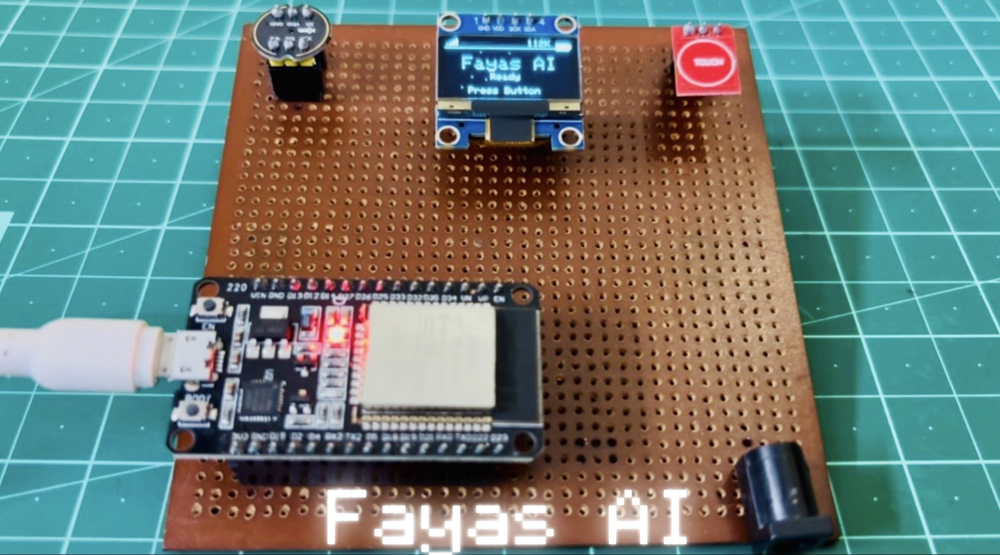
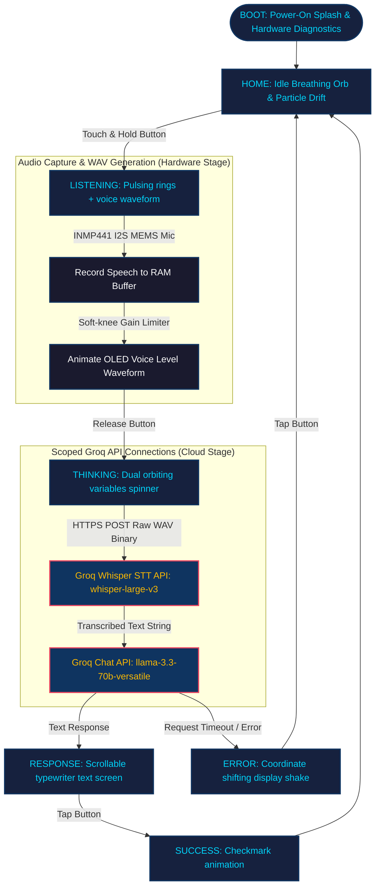

<div align="center">

# Fayas AI 🎙️

**An ESP32-powered, touch-to-talk voice assistant with a premium, fully animated OLED interface, backed by Groq's high-speed Whisper (STT) and Llama 3.3 (LLM) APIs.**

[](https://www.espressif.com/)
[](https://adafruit.com/)
[]()
[]()
[](https://www.arduino.cc/)
[](LICENSE)

<br/>



</div>

---

## 📖 Overview

Fayas AI turns an ESP32, an SSD1306 OLED screen, a push-to-talk button, and an INMP441 I2S microphone into a pocket-sized voice companion. Connect the device to Wi-Fi, hold down the button, ask a question, and release. The ESP32 records and streams your voice directly to Groq Whisper for instantaneous Speech-to-Text transcription, feeds it to a Llama-3.3-70b LLM, and typewrites the response on a manual-exit screen.

Every single visual transition (boot, home, listening, thinking, response, error, success) is animated at up to 60 FPS using non-blocking, `millis()`-based timing — there isn't a single blocking `delay()` in the graphics render path.

---

## 🔄 System Flow



---

## ✨ Features

- **Push-to-Talk Voice Capture:** Real-time speech recording via the INMP441 I2S MEMS microphone.
- **Low-Latency Conversational Architecture:** Dynamic dual HTTPS client scopes sequence Whisper and Llama completions in under **3.5 seconds** round-trip.
- **Fully Animated 60 FPS OLED Interface:**
  - **Boot Screen:** Glowing central logo with staggered startup diagnostic telemetry.
  - **Home Screen:** Sine-breathing orb floating in a particle drift field.
  - **Listening Screen:** Concentric expanding pulsing target rings and mirrored peak amplitude waveform.
  - **Thinking Screen:** Dual orbiting particles revolving at variable relative speeds indicating network activity.
  - **Response Screen:** Interactive typewriter-style page writer with auto-scrolling line wrap.
  - **Error Screen:** Coordinate shifting display shake with warning triangles and error descriptions.
  - **Success Screen:** Linear drawing checkmark confirmation animation.
- **No-Freeze Network Loops:** Animation ticks threaded through the HTTPS upload/download loop prevent the screen from freezing during server waiting.
- **Wi-Fi Watchdog:** Periodic non-blocking background watchdog managing auto-reconnection and RSSI signals.

---

## 🔩 Hardware

| Component | Purpose | Notes |
|---|---|---|
| ESP32 DevKit V1 | Main controller | Dual-core processor with I2S peripheral and built-in WiFi |
| SSD1306 OLED Display | Screen interface | 128x64 resolution, driven via 400kHz Fast I2C |
| INMP441 MEMS Mic | Audio capture | I2S digital MEMS microphone |
| Push Button / Touch Switch | Talk input | Active-HIGH Touch Switch Module (PTT mode) |

---

## 💻 Software

| Dependency | Purpose | Version |
|---|---|---|
| Arduino IDE 1.8+ / 2.x | Sketch compilation and upload | 2.0+ (Recommended) |
| ESP32 Board Package | NodeMCU / ESP32 board support | Espressif core v2.0+ |
| `Adafruit GFX Library` | Core graphics primitives | Latest |
| `Adafruit SSD1306` | OLED hardware driver | Latest |
| `ArduinoJson` | API response JSON decoding | v7.x |

---

## 📁 Project Structure

Detailed modular documentation is provided alongside the source code:

```
Fayas_AI/
├── Fayas_AI.ino                 # Entry point + top-level state machine coordinator
├── config.h                     # Pinouts, credentials (SSID/Password/Groq Key), and thresholds
├── ai.h / ai.cpp                # Groq API scoped HTTPS clients (Whisper + Llama)
├── audio.h / audio.cpp          # I2S recording driver and WAV framing logic
├── animations.h / animations.cpp# 60 FPS graphics render engines
├── display.h / display.cpp      # OLED setup and status-bar draw helpers
├── fayaswifi.h / fayaswifi.cpp  # WiFi connection manager and RSSI cache
├── utils.h / utils.cpp          # Debouncers, non-blocking timers, and bar converters
├── LICENSE                      # MIT License
├── README.md                    # Main repository document
└── .gitignore                   # Ignore rules for build caches and temp directories
```

---

## 🔗 Circuit Connections

| Component Module | Pin Name | ESP32 GPIO | Direction | Notes |
|---|---|---|---|---|
| SSD1306 OLED | SDA | GPIO 21 | I/O | Fast I2C Serial Data |
| SSD1306 OLED | SCL | GPIO 22 | Output | Fast I2C Serial Clock |
| INMP441 Mic | SD | GPIO 33 | Input | I2S Serial Data Out |
| INMP441 Mic | WS | GPIO 25 | Output | I2S Word Select / Frame Clock |
| INMP441 Mic | SCK | GPIO 26 | Output | I2S Bit Clock (1.024 MHz) |
| INMP441 Mic | L/R | GND | Input | Grounded to select Left Channel |
| Touch Button | OUT | GPIO 27 | Input | Active-HIGH touch input |

---

## ⚙️ Installation & Configuration

**1. Clone the repository**

```bash
git clone https://github.com/MohammadFayasKhan/FayasAI.git
cd FayasAI
```

**2. Configure credentials in `config.h`**

Open [config.h](config.h) and set your local network credentials and Groq API Key on the following lines:

* **`WIFI_SSID` (Line 29):** The SSID (name) of your local Wi-Fi router. Note that the ESP32 only supports 2.4 GHz bands.
  ```cpp
  #define WIFI_SSID       "your_wifi_ssid_here"
  ```
* **`WIFI_PASSWORD` (Line 30):** The security password for your Wi-Fi router.
  ```cpp
  #define WIFI_PASSWORD   "your_wifi_password_here"
  ```
* **`AI_API_KEY` (Line 44):** Your Groq Console API authentication key. Get a free API key instantly at the [Groq Console](https://console.groq.com/keys).
  ```cpp
  #define AI_API_KEY      "gsk_your_groq_key_here"
  ```

**3. Upload**

- Open `Fayas_AI.ino` in the Arduino IDE.
- Select your board: `Tools → Board → ESP32 Arduino → ESP32 Dev Module`.
- Select your partition scheme: `Tools → Partition Scheme → Huge APP (3MB No OTA / 1MB SPIFFS)`.
- Select the serial COM port.
- Click **Upload**.

---

## 🚀 Usage

1. Power on the device.
2. The OLED screen displays the **Boot Animation** followed by the **Home Screen** (breathing orb with floating particles).
3. **Talk:** Touch and hold the button. The screen shifts to **Listening** showing pulsing target rings and your voice peak level waveform.
4. **Send:** Release the button. The screen transitions to **Thinking** (rotating spinner) while connecting and fetching data from Groq.
5. **View:** The response is written on the screen as a typewriter. Scroll the page by holding the button if the response is long.
6. **Reset:** Tap the button to return to the Home screen.

---

## 🧠 How It Works

**Dual-Scope Connection Handshake**
Consecutive secure handshakes require massive dynamic memory allocations (~40KB). To prevent out-of-memory errors on the ESP32, Fayas AI isolates the STT (Whisper) and Chat (Llama) clients inside sequential C++ scopes `{ ... }`. When the first scope block ends, the client destructor runs, immediately freeing the SSL heap buffers. After a `delay(150)` defragmentation window, the second scope starts, successfully connecting with a fresh heap.

**I2S Modulator Slot Configuration**
The INMP441 digital MEMS microphone modulator requires at least 24 BCLK cycles per frame slot to activate. Fayas AI configures standard I2S Standard MSB modes in **32-bit slot widths**. Samples are read into a 32-bit buffer, shifted right in software (`>> 16`) to retrieve the 16-bit PCM voice, boosted by a soft-knee gain limiter, and written to a pre-allocated WAV file in RAM.

**Non-Blocking Rendering**
All displays are animated at up to 60 FPS using `millis()` timing. The HTTPS network clients call a progress hook (`tick(onProgress)`) during socket connects and byte transmissions. This allows the orbital spinner to keep rotating continuously during active API uploads and downloads.

---

## 🖼️ Screenshots

<div align="center">
<table>
  <tr>
    <td align="center" width="50%">
      
      <p align="center"><b>Visual Screens</b><br/><sup>Breathing Orb, waveform inputs, orbital spinners, and error alerts</sup></p>
    </td>
    <td align="center" width="50%">
      
      <p align="center"><b>Hardware Prototype</b><br/><sup>ESP32 DevKit + INMP441 Mic + SSD1306 OLED on breadboard</sup></p>
    </td>
  </tr>
</table>
</div>

---

## 🤝 Contributing

1. Fork the repository
2. Create a feature branch: `git checkout -b feature/your-feature`
3. Commit your changes: `git commit -m 'feat: description'`
4. Push and open a Pull Request

---

## 📄 License

MIT License. See [LICENSE](LICENSE) for details.

---

## 👤 Author

**Mohammad Fayas Khan**

GitHub → [MohammadFayasKhan](https://github.com/MohammadFayasKhan)

*Built for learning, experimentation, and embedded systems exploration.*
