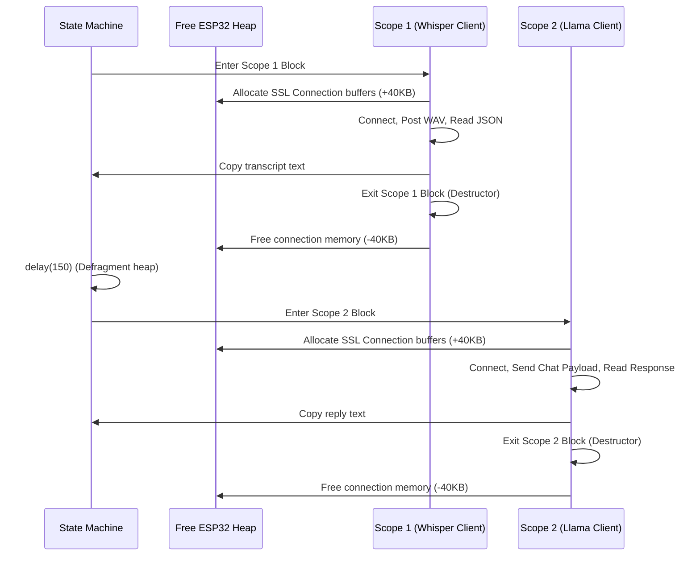

# ai.cpp

The engine implementation for the Groq AI API client. It processes Speech-to-Text (Whisper) and Chat Completion (Llama 3.3) over two distinct, sequential HTTPS connections, managing memory dynamically to avoid heap fragmentation.

---

## 🗺️ Scoped Handshake Architecture



---

## ⚙️ Core Operations

### 1. Isolated Connection Scopes
Instead of maintaining a persistent SSL session, which keeps massive handshakes resident in memory, `sendAudio()` runs step 1 and step 2 inside two distinct, isolated C++ curly-braced scopes:
- **Scope 1 (Whisper STT):** Instantiates `WiFiClientSecure client`, completes the SSL handshake, streams the WAV data, reads the transcript, and terminates. Once the scope block ends, the client's destructor runs, immediately reclaiming **~40KB of heap buffers**.
- **Scope 2 (Chat Completion):** After a `delay(150)` memory cooling period, instantiates a fresh `WiFiClientSecure` to connect to the Chat completion endpoint. Since the STT memory was fully reclaimed, the new SSL handshake succeeds without running out of RAM.

### 2. Multi-Part Binary Streaming
- Generates standard HTTP multi-part headers.
- Rather than encoding binary WAV files in Base64 (which incurs a 33% size inflation and requires a second huge memory copy), `ai.cpp` streams raw WAV binary directly in **1KB chunks** using:
  ```cpp
  client.write(wavData + offset, writeLen);
  ```
- This keeps the ESP32 memory footprint minimal and speeds up transmission.

### 3. Progressive Frame Ticking
Throughout socket connection, multi-part headers streaming, file writing, and HTTP response parsing, the function calls `tick(onProgress)` to run display frames. This keeps OLED spinner animations running smoothly.

### 4. Response Header and Body Parsing
- `readHttpStatusAndHeaders()` reads HTTP status lines, parses status codes, and extracts `Content-Length` fields.
- The Whisper STT response is decoded using `ArduinoJson` to get the transcription string, which is then copied to a persistent `String` object before the Whisper heap structures are destroyed.
- The Chat Completion response is sent with `Connection: close` to prevent Cloudflare gateway hangs, parsed, and output as the final conversational reply.
