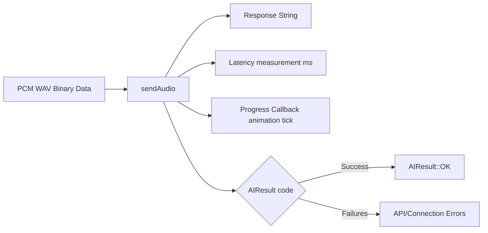

# ai.h

The interface header for the Groq AI API client. It defines the state return codes and signatures for sending captured voice data and receiving conversational completions.

---

## 🗺️ Client API Data Flow



---

## 🏛️ Structures and Types

### `enum class AIResult`
Return values used by the application state machine to determine success or navigate to error states:
- `OK`: Both Whisper STT and Chat Completion completed successfully.
- `ERR_WIFI_DISCONNECTED`: Request aborted because Wi-Fi link is down.
- `ERR_CONNECT_FAILED`: TCP connection to `api.groq.com:443` failed.
- `ERR_HTTP_STATUS`: Server returned a non-2xx status code (e.g. 401 unauthorized, 429 rate-limited).
- `ERR_TIMEOUT`: Server failed to send headers or body within `AI_HTTP_TIMEOUT_MS`.
- `ERR_MALFORMED_JSON`: Server returned bad JSON, or missing required fields.
- `ERR_EMPTY_RESPONSE`: Whisper returned no transcribed text (silence/mumble).

### `typedef void (*ProgressCallback)()`
A callback function signature. This is invoked regularly during heavy network traffic and reading operations, allowing animations to run smoothly without freezing the display.

---

## ⚙️ Core Functions

### `AIResult sendAudio(...)`
```cpp
AIResult sendAudio(const uint8_t* wavData, size_t wavSize, 
                  String& outResponse, unsigned long& outLatencyMs, 
                  ProgressCallback onProgress);
```
- Sends raw WAV binary from ESP32 RAM to Groq Whisper for STT transcription, then queries Llama-3.3 for the response.
- **Arguments:**
  - `wavData`: Pointer to raw PCM WAV bytes in heap memory.
  - `wavSize`: Byte count of the WAV file.
  - `outResponse`: Output string containing the final answer.
  - `outLatencyMs`: Output variable to measure API network performance.
  - `onProgress`: Non-blocking drawing callback.

### `const char* resultToMessage(AIResult result)`
- Converts an `AIResult` enum value into a user-friendly, multi-line error string shown on the OLED screen.
