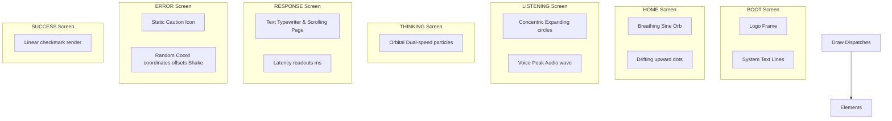

# animations.cpp

The visual rendering engine for Fayas AI. It implements all animations (boot, home, listening, thinking, typewriter responses, shaking errors, and success checkmarks) at 60 FPS using non-blocking math.

---

## 🗺️ Render Layout Elements

---

## 🎨 Rendering Modules

### 1. Boot Screen (`renderBoot()`)
- Animates a glowing central logo.
- Prints system startup telemetry (Heap, I2C, I2S status) line-by-line using a staggered timer.
- Returns `true` once all lines are drawn.

### 2. Home Screen (`renderHome(...)`)
- **Breathing Orb:** Uses sine/cosine math (`sin(millis() / 400.0f)`) to expand and contract a glowing orb.
- **Particle Field:** Manages coordinates for floating dots. The dots drift upwards, wrapping around once they exceed the screen boundaries.
- **WiFi Status Bar:** Renders battery-level and WiFi signal bars.

### 3. Listening Screen (`renderListening(...)`)
- **Pulsing Rings:** Draws concentric circles that expand outward, fading dynamically as they reach the screen edge.
- **Audio Waveform:** Renders a mirrored wave at the bottom of the screen. The wave height updates dynamically based on peak voice levels read from the I2S driver (`FayasAudio::getPeakAmplitude()`).

### 4. Thinking Screen (`renderThinking(...)`)
- **Double Orbiter:** Draws two small glowing orbs rotating in circles at different radii and speeds:
  - Orb 1 (Inner): Fast rotation speed.
  - Orb 2 (Outer): Slower rotation speed.
- The animation is triggered continuously during the STT and Chat HTTPS requests via progress callbacks.

### 5. Response Screen (`renderResponse(...)`)
- **Typewriter Text:** Renders characters one-by-one using a timer.
- **Scrolling Page:** Tracks cursor coordinates. If the text exceeds the screen boundaries, it scrolls up automatically.
- **Diagnostics Overlay:** Displays request round-trip latency at the bottom of the screen.

### 6. Error Screen (`renderError(...)`)
- Renders a warning sign.
- Shakes the screen by adding random offsets (`random(-2, 3)`) to the display coordinates.
- Displays specific error messages (e.g. WiFi Lost, Connect Failed, Request Timeout, API Error).

### 7. Success Screen (`renderSuccess()`)
- Draws a checkmark.
- Returns `true` when the checkmark animation finishes, automatically returning to the Home screen.
