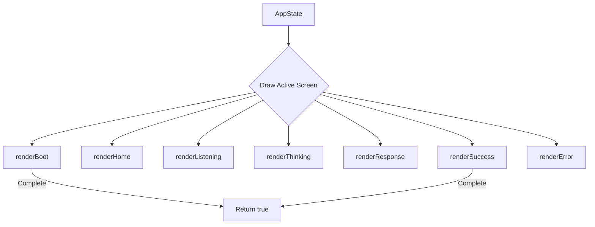

# animations.h

The interface header for the non-blocking OLED rendering engine. It defines the entry points, animation controls, and rendering assets for all application states.

---

## 🗺️ Render Layout Selection

---

## 🏛️ Core Functions

### `void begin()`
- Registers display handles.
- Seeds random coordinates for particle fields and UI layouts.

### `void onEnterState(AppState state)`
- Reset timers, typewriter scroll values, and particle directions.
- Called during state transitions to ensure animations start from a clean state.

### Drawing Dispatches (`renderBoot`, `renderHome`, etc.)
- Non-blocking layout loops.
- Return `true` if their visual transition is complete (e.g. checkmark completed, boot animation finished).
  - `bool renderBoot()`
  - `void renderHome(...)`
  - `void renderListening(...)`
  - `void renderThinking(...)`
  - `void renderResponse(...)`
  - `bool renderSuccess()`
  - `void renderError(...)`

---

## 🎨 Layout Assets & Helpers

- **Icons:** Standard pixel matrices for warning triangles and WiFi signal bars.
- **`updateFloatingParticles()`**: Shared background particle generator that runs on the Home screen to create floating bubble effects.
