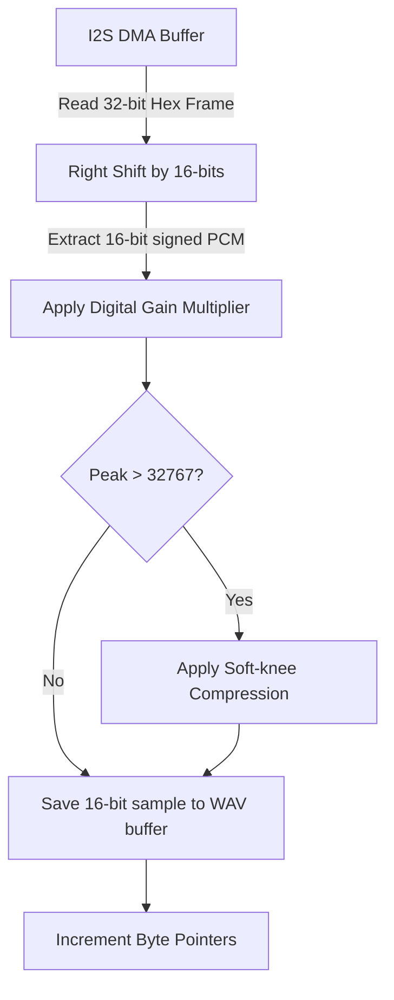

# audio.cpp

The implementation of the I2S microphone recording driver for the ESP32. It configures standard I2S peripherals, captures audio in 32-bit slot width format (required by the INMP441 modulator), performs digital shift alignment, applies gain, filters noise, and writes standard PCM WAV files in RAM.

---

## 🗺️ Audio Sampling Pipeline



---

## ⚙️ Core Functions & Details

### 1. I2S Configuration
Uses the modern ESP32 standard I2S driver (`driver/i2s_std.h`).
* **INMP441 Modulator Clock Requirement:** The INMP441 requires at least 24 BCLK clocks per frame slot to activate its internal modulator. It is configured in **32-bit slot width** format:
  ```cpp
  .slot_cfg = I2S_STD_MSB_SLOT_DEFAULT_CONFIG(I2S_DATA_BIT_WIDTH_32, I2S_SLOT_MODE_MONO)
  ```
  If configured in 16-bit slots, BCLK outputs only 16 clocks, causing the microphone to output silent data.

### 2. Software Alignment and Gain
During recording, `pump()` reads data into a 32-bit buffer and shifts it right in software to retrieve the actual voice samples:
- **Shift & Gain:**
  ```cpp
  int32_t val32 = samples32[i] >> 16; // Shift 32-bit slot data to 16-bit
  float sampleF = (float)val32 * AUDIO_GAIN_MULTIPLIER; // Apply software digital gain
  ```
- **Limiter:** Compresses peaks exceeding +/-32767 smoothly (using soft-knee clipping) to prevent square-wave distortion.
- **Decimation:** Writes the processed 16-bit sample into the heap buffer.

### 3. Startup Stabilization (Solving `0xFFFFFFFF` Bus Idle)
- When the button is pressed, `startRecording()` calls `i2s_channel_disable` followed by `i2s_channel_enable`. This resets all DMA descriptors and clears FIFO overflows.
- A `delay(100)` pauses execution with BCLK running to give the microphone's power supply and digital decimation filters time to boot.
- The function then drains/discards all startup samples from the I2S queue before starting voice capture:
  ```cpp
  while (i2s_channel_read(s_rxHandle, tempBuf, sizeof(tempBuf), &bytesRead, 0) == ESP_OK && bytesRead > 0) {}
  ```

### 4. Memory Allocations
- To avoid memory fragmentation, the recording buffer (`s_buffer`) is allocated **once** during boot:
  ```cpp
  s_buffer = (uint8_t*)malloc(s_bufferMaxBytes);
  ```
  It is retained throughout the application lifecycle.

### 5. Canonical WAV Formatting
Upon completion, `finalizeWav()` prepends a standard 44-byte WAV header directly into the reserved header slot in the buffer:
- Writes the `"RIFF"` and `"WAVE"` headers.
- Formats metadata (16-bit PCM, Mono, 8000Hz sample rate).
- Fills in overall file size and byte counts.
