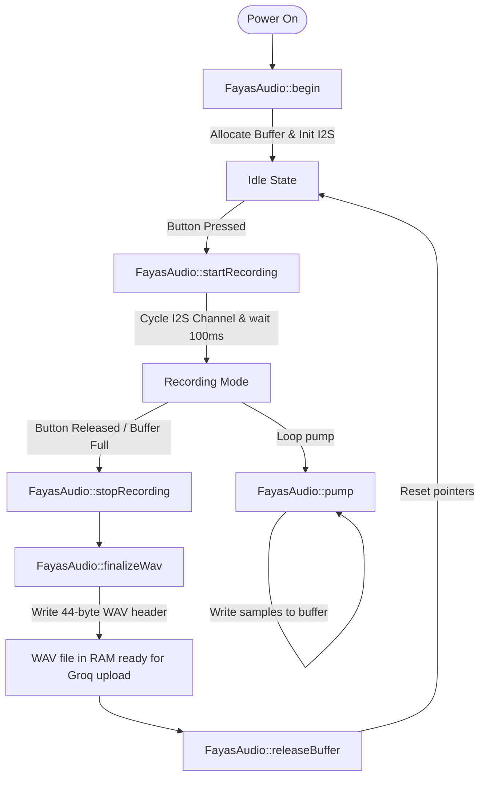

# audio.h

The interface header for the ESP32 standard I2S audio recording module. It manages the I2S microphone peripheral, recording buffers, and WAV framing.

---

## 🗺️ Interface Lifecycle

---

## ⚙️ Core Functions

### `bool begin()`
- Allocates a permanent, contiguous PCM audio buffer in heap memory.
- Initializes the standard ESP32 standard I2S driver on `I2S_NUM_0`.
- Returns `true` if initialization succeeds.

### `void startRecording()`
- Prepares variables for a fresh recording.
- Resets the I2S hardware by disabling and re-enabling the RX channel to clear accumulated DMA descriptor overflows.
- Blocks for **100ms** to allow the microphone power and digital filters to boot and stabilize.
- Flushes/drains startup noise from the I2S queue before recording actual voice data.

### `bool pump()`
- Non-blocking function called in the main loop to read available audio frames from the I2S DMA queue.
- Performs downsampling, applies software gain, and writes structured samples to the audio buffer.
- Returns `true` if the recording buffer is full.

### `void stopRecording()`
- Stops the recording process.
- Sets flags to prevent further data accumulation.

### `uint8_t* finalizeWav(size_t& outWavSize)`
- Writes a standard 44-byte canonical WAV header at the beginning of the audio buffer.
- Computes correct file sizes, data lengths, and audio format markers.
- Returns a pointer to the complete, ready-to-upload WAV file in RAM.

### `void releaseBuffer()`
- Safely releases/resets the audio recording buffer index, readying it for subsequent calls.

### `unsigned long getElapsedMs()`
- Returns the elapsed time (in milliseconds) since the current recording session started.

### `int getPeakAmplitude()`
- Returns the peak-to-peak amplitude of the last captured chunk (normalized to a range of 0 to 100), used to animate OLED waveforms in real-time.
