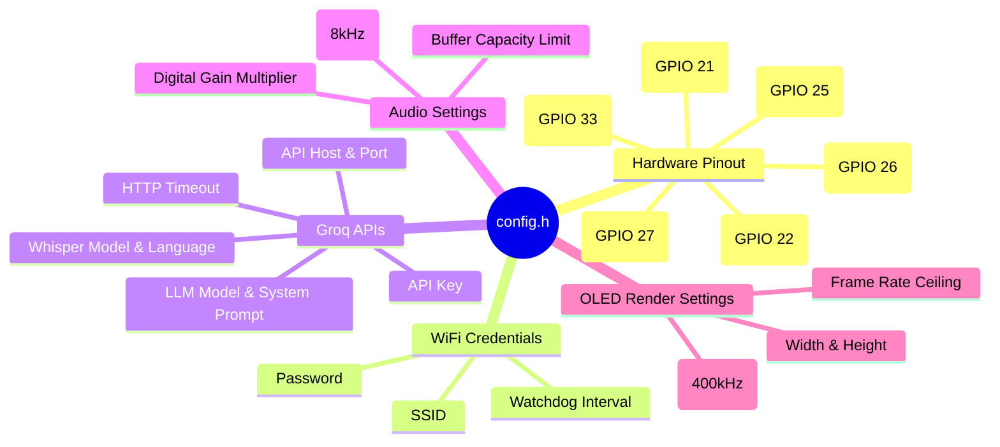

# config.h

The unified configuration header for the Fayas AI project. All pins, connection credentials, timing parameters, and threshold constants reside here to keep the rest of the codebase clean and modular.

---

## 🗺️ Configuration Categories

---

## 🛠️ Configuration Groups

### 1. Telemetry Settings
- `SERIAL_BAUD_RATE` (Default: `115200`): Serial monitor console baud rate.
- `DEBUG_MODE_DEFAULT` (Default: `false`): Enables developer debugging details on-screen.

### 2. Wi-Fi Settings
- `WIFI_SSID` & `WIFI_PASSWORD`: Access credentials for local network.
- `WIFI_RECONNECT_INTERVAL_MS` (Default: `10000UL`): Background network polling timeout.

### 3. Groq API Configurations
- `AI_API_KEY`: Auth token for Groq API access.
- `AI_API_HOST` (Default: `"api.groq.com"`) & `AI_API_PORT` (Default: `443`): Secure API host endpoints.
- `GROQ_WHISPER_MODEL` (Default: `"whisper-large-v3"`): Speech transcription model.
- `GROQ_WHISPER_LANGUAGE` (Default: `"en"`): Pinpoint language to optimize transcription and eliminate background translations.
- `GROQ_WHISPER_PROMPT`: Direct context hints containing terms like "Fayas AI" to steer Whisper away from silence hallucinations.
- `GROQ_LLM_MODEL` (Default: `"llama-3.3-70b-versatile"`): Versatile, ultra-fast language model.
- `AI_SYSTEM_PROMPT`: Rules instructing Llama to keep output plain-text, verbal, direct, and under 1-3 sentences.
- `AI_HTTP_TIMEOUT_MS` (Default: `20000UL`): Timeout limit for API requests.

### 4. OLED SSD1306 Display Configuration
- `SCREEN_WIDTH` (128) & `SCREEN_HEIGHT` (64): Pixels dimensions of SSD1306 displays.
- `OLED_I2C_ADDRESS` (Default: `0x3C`): Fast-mode standard device address.
- `OLED_SDA_PIN` (GPIO 21) & `OLED_SCL_PIN` (GPIO 22): Dedicated I2C bus pins.
- `FRAME_INTERVAL_MS` (Default: `16UL`): Timing ceiling matching ~60 FPS.

### 5. Push-to-Talk Button Config
- `BUTTON_PIN` (GPIO 27): Button pin.
- `BUTTON_ACTIVE_LOW` (Default: `false`): Set to `true` for standard pull-up buttons; `false` for active-HIGH capacitive modules.
- `BUTTON_DEBOUNCE_MS` (Default: `100UL`): Debounce window to filter out adjacent I2S high-frequency clock noise.

### 6. I2S MEMS Microphone Configurations
- `I2S_MIC_WS_PIN` (GPIO 25), `I2S_MIC_SCK_PIN` (GPIO 26), and `I2S_MIC_SD_PIN` (GPIO 33): I2S peripheral pin wiring.
- `AUDIO_SAMPLE_RATE_HZ` (Default: `8000`): Sample rate (8kHz).
- `AUDIO_GAIN_MULTIPLIER` (Default: `6.0f`): Software digital gain applied to the I2S microphone samples prior to compression.
- `AUDIO_MAX_RECORD_SECONDS` (Default: `10`): Safety recording ceiling to stay within free heap allocation thresholds.
