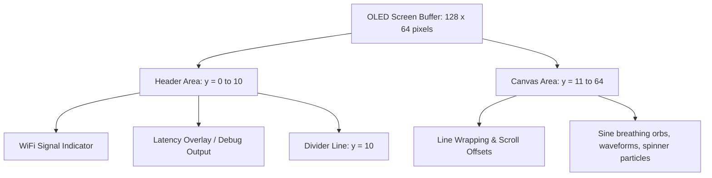

# display.cpp

The hardware abstraction layer for the SSD1306 OLED display. It manages display initialization, drawing primitives, status bars, and text wrapping.

---

## 🗺️ Display Screen Layout Map

---

## ⚙️ Core Operations

### 1. I2C Bus Initialization
- `begin()` starts I2C using configured pins (`OLED_SDA_PIN`, `OLED_SCL_PIN`).
- Sets the bus frequency to **400kHz** (`OLED_I2C_CLOCK_HZ`) to double screen refresh speeds and prevent frame tearing.

### 2. SSD1306 Driver Allocation
- Instantiates the `Adafruit_SSD1306` driver using the heap.
- Performs hardware resets if `OLED_RESET_PIN` is configured.

### 3. Display Buffer Writes
- `display()` transfers local screen buffers to the display hardware via I2C block writes.

### 4. Text Wrapping Engine
- `drawText()` wraps text within the screen boundaries. It splits lines at space characters rather than mid-word to ensure text remains readable.

### 5. Status Bar Layout
- `drawStatusBar()` reserves a 10px tall area at the top of the screen:
  - **WiFi Signal Icon:** Displays signal strength bars or a "Disconnected" indicator.
  - **Debug Overlay:** Shows heap usage or system diagnostics.
  - Separates the status bar from the content area with a horizontal line.
