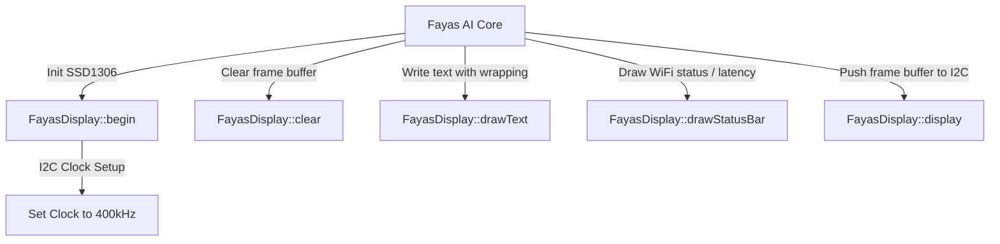

# display.h

The interface header for the SSD1306 OLED display driver. It wraps graphics buffer management, text wrapping, and brightness controls.

---

## 🗺️ Display Wrapper Actions

---

## ⚙️ Core Functions

### `bool begin()`
- Starts the I2C interface.
- Initializes the SSD1306 controller.
- Sets the I2C clock rate to **400kHz** (Fast Mode) for smooth rendering.
- Returns `true` if initialization succeeds.

### `Adafruit_SSD1306* getDevice()`
- Returns a pointer to the global `Adafruit_SSD1306` object, allowing other modules to access graphics primitives directly.

### `void clear()`
- Clears the internal frame buffer.

### `void display()`
- Pushes the local frame buffer to the physical OLED controller.

### `void drawText(...)`
- High-level text renderer supporting custom coordinates, scales, colors, and line-wrapping rules.

### `void drawStatusBar(...)`
- Renders the system header (status icons, WiFi state, debug overlay) at the top of the display.
