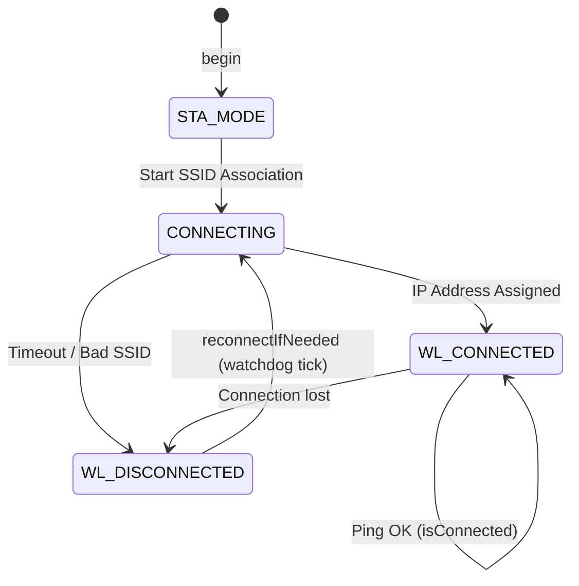

# fayaswifi.h

The interface header for the WiFi connection manager. It handles credentials, auto-reconnection tasks, and signal diagnostics.

---

## 🗺️ Connection State Machine

---

## ⚙️ Core Functions

### `void begin()`
- Configures WiFi hardware in Station mode.
- Initiates the connection using credentials in `config.h`.

### `bool isConnected()`
- Returns `true` if connected to a local WiFi network.

### `void reconnectIfNeeded()`
- Periodically checks the network link status.
- Automatically attempts to reconnect if the connection drops.

### `int getRSSI()`
- Returns the signal strength (RSSI in dBm) of the current WiFi connection.
