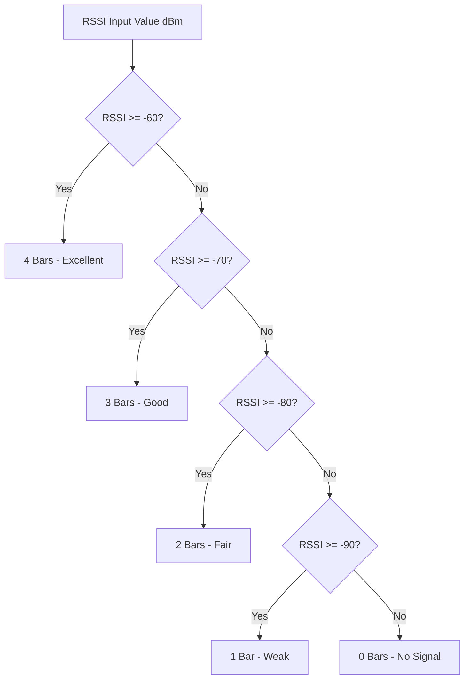

# utils.cpp

The implementation of helper utilities (non-blocking timers, debounced button samplers, and coordinate conversions).

---

## 🗺️ WiFi Signal Bars Mapping



---

## ⚙️ Core Operations

### 1. Non-Blocking Timers (`NonBlockingTimer`)
- Implements `ready()` using non-blocking, `millis()`-based math:
  ```cpp
  unsigned long now = millis();
  if (now - m_lastTime >= m_intervalMs) {
      m_lastTime = now;
      return true;
  }
  return false;
  ```
- Prevents thread blocking and screen freezes.

### 2. Debounced Button Sampler (`DebouncedButton`)
- Implements a state-machine debouncer to filter out contact bounce and electrical noise:
  - **Press Detection:** Debounces transitions to prevent double triggers.
  - **Release Detection:** Triggers immediately when the button is released.
- Solves issues with high-frequency noise from adjacent clock lines by matching sample states over a configured time window (`BUTTON_DEBOUNCE_MS`).

### 3. Signal Conversions (`rssiToBars`)
- Maps standard RSSI decibels (dBm) to a 0-4 bar scale:
  - RSSI >= -60 dBm: 4 Bars (Excellent)
  - RSSI >= -70 dBm: 3 Bars (Good)
  - RSSI >= -80 dBm: 2 Bars (Fair)
  - RSSI >= -90 dBm: 1 Bar (Weak)
  - RSSI < -90 dBm: 0 Bars (No Signal)
