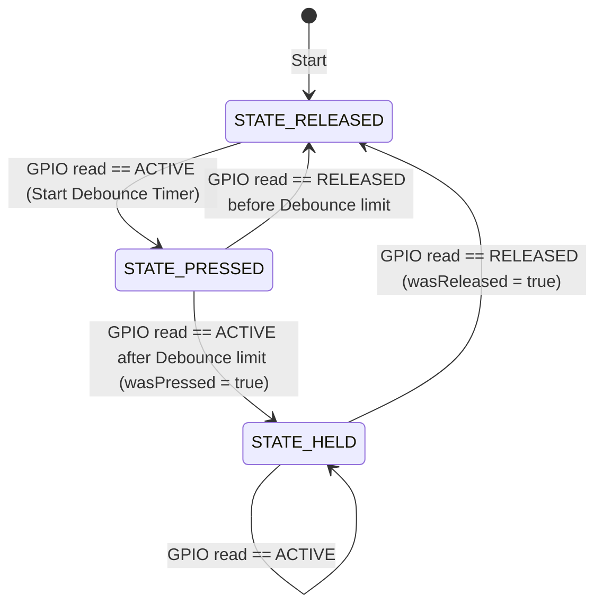

# utils.h

The interface header for general helper modules. It defines the application state enumeration, non-blocking timer utilities, debounced button samplers, and coordinate conversions.

---

## 🗺️ Button Debounce State Flow

---

## 🏛️ Structures and Types

### `enum class AppState`
The global state enum used by the main coordinator:
- `BOOT`: Initial startup splash.
- `HOME`: Idle resting state.
- `LISTENING`: Active audio recording.
- `THINKING`: HTTP request processing.
- `RESPONSE`: Interactive text output.
- `SUCCESS`: Task complete confirmation.
- `ERROR_STATE`: Error display and retry trigger.

### `class NonBlockingTimer`
A `millis()`-based timer wrapper:
- `ready()`: Returns `true` if the interval has passed, resetting the timer.
- `reset()`: Manually resets the timer.

### `class DebouncedButton`
A debounced GPIO input reader:
- `begin()`: Configures the GPIO pin.
- `update()`: Samples the pin state.
- `isPressed()`: Returns `true` if the button is pressed.
- `wasPressed()`: Returns `true` if the button was pressed during the last update cycle.
- `wasReleased()`: Returns `true` if the button was released during the last update cycle.

---

## ⚙️ Core Functions

### `int rssiToBars(int rssi)`
- Converts raw WiFi RSSI values (in dBm) to a signal strength scale of 0 to 4 bars.
